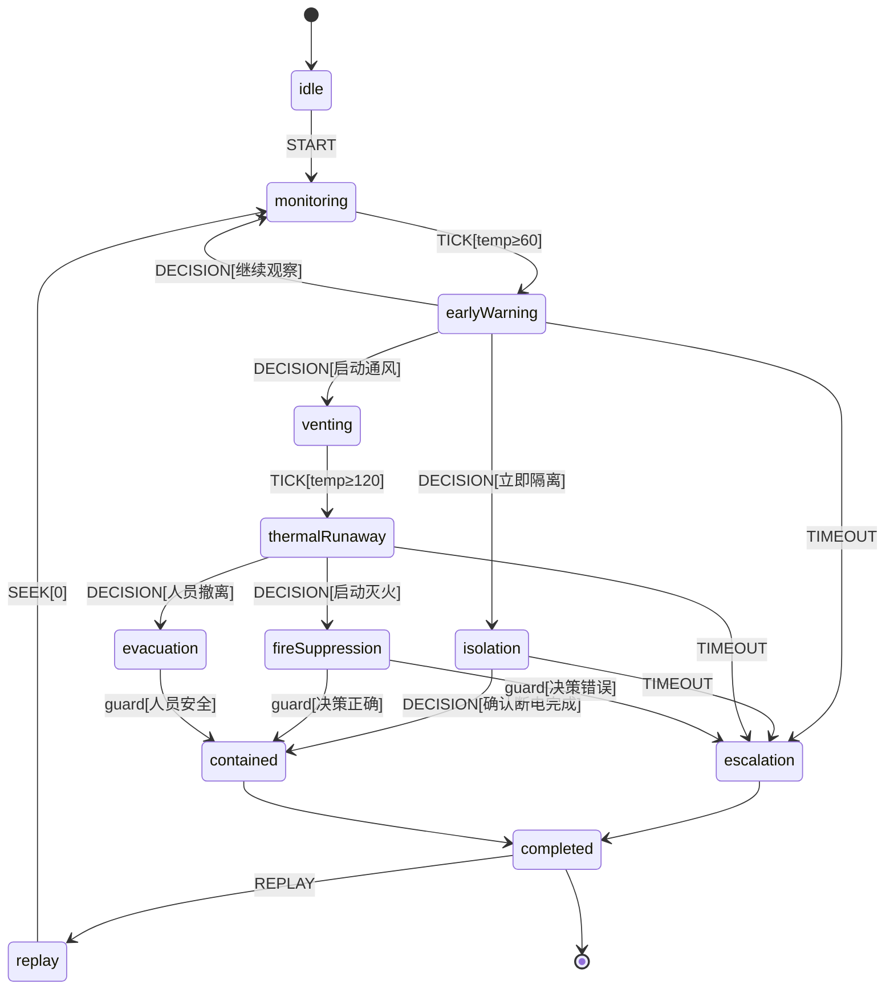

# 事故推演引擎 — 架构设计（单电池热失控处置）

> 基于 SafeLearn 现有 Vue3 + Three.js + Spring Boot 栈，引入 XState 状态机驱动分支推演。

---

## 1. 推演引擎总体架构

```
┌──────────────────────────────────────────────────────────────────────────┐
│                         Presentation（Vue3）                              │
│  SimulationView │ DecisionPanel │ ReplayPanel │ ScoreReport │ Timeline   │
└─────────────────────────────────┬────────────────────────────────────────┘
                                  │ useDeductionEngine()
┌─────────────────────────────────▼────────────────────────────────────────┐
│                      Deduction Engine（Frontend Core）                      │
│  ┌─────────────────┐   ┌──────────────┐   ┌─────────────────────────┐  │
│  │ XState Actor    │◄──│ TimeEngine   │──►│ ReplayEngine            │  │
│  │ thermalRunaway  │   │ tick/seek    │   │ event-log playback      │  │
│  │ Machine         │   │ speed control│   │ snapshot restore        │  │
│  └────────┬────────┘   └──────────────┘   └─────────────────────────┘  │
│           │ emits DeductionSceneEvent[]                                   │
│  ┌────────▼────────┐   ┌──────────────────────────────────────────────┐  │
│  │ SceneBridge     │──►│ BatteryScene │ ParticleSystem │ TempField   │  │
│  │ (Three.js 适配) │   └──────────────────────────────────────────────┘  │
└─────────────────────────────────┬────────────────────────────────────────┘
                                  │ REST + 可选 WebSocket
┌─────────────────────────────────▼────────────────────────────────────────┐
│                    Spring Boot — deduction 模块                             │
│  DeductionController                                                      │
│    ├─ DeductionSessionService   会话生命周期（start/pause/resume/finish） │
│    ├─ DeductionEventService     事件日志持久化（回放数据源）              │
│    ├─ DeductionScoringService   规则评分 + AI 教官评分                    │
│    ├─ DeductionReplayService    服务端回放校验 / 报告生成                 │
│    └─ DeductionAnalyticsService 培训成绩统计 / 仪表盘                     │
└─────────────────────────────────┬────────────────────────────────────────┘
                                  │
┌─────────────────────────────────▼────────────────────────────────────────┐
│                              MySQL                                        │
│  scenarios（已有）│ simulation_sessions │ simulation_event_logs           │
│  simulation_decisions │ simulation_score_reports │ simulation_snapshots  │
└──────────────────────────────────────────────────────────────────────────┘
```

### 核心设计原则

| 原则 | 说明 |
|------|------|
| **状态机驱动** | 事故阶段、分支、决策窗口全部由 XState 定义，避免 if-else 散落 |
| **时间轴与状态解耦** | TimeEngine 只负责 `elapsedMs`；状态转移由 guards + 场景脚本触发 |
| **事件溯源** | 所有 TICK / DECISION / STATE_CHANGE 写入 event log，ReplayEngine 可 100% 复现 |
| **3D 只订阅** | SceneBridge 订阅引擎输出，Three.js 不反向驱动业务逻辑 |
| **前后端分工** | 推演实时性在前端；持久化、评分、统计在后端 |

### 与现有模块关系

- `useSimulation.ts` → 保留为**物理演示层**（温度扩散算法）
- `useDeductionEngine.ts` → 新增**决策推演层**（XState + 分支 + 评分）
- `TrainingView.vue` → 应急决策训练（题库模式）
- `SimulationView.vue` → 逐步迁移为 DeductionEngine 驱动

---

## 2. TypeScript 类型设计

见 `frontend/src/simulation/types/deduction.types.ts`

---

## 3. XState 状态图（单电池热失控）



### 状态说明

| 状态 | 含义 | 3D 表现 |
|------|------|---------|
| `monitoring` | 正常运行，温度缓升 | 单电芯黄色预警光晕 |
| `earlyWarning` | 首触决策点（60°C） | 告警 UI + 温度曲线跳变 |
| `venting` | 通风处置分支 | 排风动画、气体浓度下降 |
| `isolation` | 电气隔离分支 | 断路器动画、电流归零 |
| `thermalRunaway` | 热失控 | 烟雾粒子 + 温度>200°C |
| `fireSuppression` | 灭火决策 | 喷淋/气溶胶特效 |
| `contained` | 事态受控 | 温度回落、告警解除 |
| `escalation` | 处置失败/扩大 | 火焰扩散、全屏红警 |
| `completed` | 推演结束 | 评分面板 |
| `replay` | 回放模式 | 按 event log 驱动 |

---

## 4. Spring Boot 模块设计

```
com.safelearn.deduction
├── controller
│   └── DeductionController.java       # REST API
├── service
│   ├── DeductionSessionService.java   # 会话 CRUD
│   ├── DeductionEventService.java     # 事件日志批量写入
│   ├── DeductionScoringService.java   # 规则分 + 调用 AI
│   ├── DeductionReplayService.java    # 回放数据组装
│   ├── DeductionAnalyticsService.java # 统计聚合
│   └── AiInstructorService.java       # LLM 评分
├── entity
│   ├── SimulationSession.java
│   ├── SimulationEventLog.java
│   ├── SimulationDecision.java
│   ├── SimulationScoreReport.java
│   └── SimulationSnapshot.java
├── repository
│   └── (对应 JPA Repository)
└── dto
    ├── StartSessionRequest.java
    ├── SubmitDecisionRequest.java
    ├── SessionStateResponse.java
    └── ScoreReportResponse.java
```

### API 设计

| Method | Path | 说明 |
|--------|------|------|
| POST | `/api/deduction/sessions` | 创建推演会话 |
| GET | `/api/deduction/sessions/{id}` | 获取会话详情 |
| POST | `/api/deduction/sessions/{id}/events` | 批量上报事件（前端每 5s 或状态变更） |
| POST | `/api/deduction/sessions/{id}/decisions` | 提交用户决策 |
| POST | `/api/deduction/sessions/{id}/finish` | 结束推演，触发评分 |
| GET | `/api/deduction/sessions/{id}/replay` | 获取回放事件序列 |
| GET | `/api/deduction/sessions/{id}/score` | 获取评分报告 |
| GET | `/api/deduction/analytics/user/{userId}` | 用户推演统计 |
| GET | `/api/deduction/analytics/scenario/{scenarioId}` | 场景维度统计 |

---

## 5. MySQL 表设计

见 `backend/src/main/resources/deduction_schema.sql`

---

## 6. Three.js 事件联动设计

```
DeductionEngine.onSceneEvent(event)
        │
        ▼
   SceneBridge.dispatch(event)
        │
        ├── cell:temperature   → BatteryScene.updateCellTemp()
        ├── cell:status        → BatteryScene.setCellStatus()
        ├── fx:smoke           → ParticleSystem.setSmokeIntensity()
        ├── fx:fire            → ParticleSystem.setFireIntensity()
        ├── fx:ventilation     → 排风模型旋转 + 气体材质 alpha
        ├── fx:isolation       → 断路器 mesh 位移动画
        ├── env:gasLevel       → 场景 fog 密度
        ├── ui:alert           → Vue 层 ElNotification
        └── camera:focus       → OrbitControls 目标电芯
```

**事件契约**（`DeductionSceneEvent`）保证 3D 层零业务逻辑。

---

## 7. ReplayEngine 实现方案

1. **记录阶段**：SimulationEngine 每次 `send()` 后，将 `{ seq, timestamp, type, payload, machineState }` push 到 `eventLog[]`，并异步 POST 到后端。
2. **回放阶段**：
   - `ReplayEngine.load(events)` 按 `seq` 排序
   - `play(speed)` 用 `requestAnimationFrame` 按 `timestamp` 差值 dispatch
   - `seek(t)` 二分查找最近快照 + 增量 replay 到目标时刻
3. **快照策略**：每进入新状态或每 10s 保存 `SimulationSnapshot`（cells + machineState + elapsedMs）
4. **服务端校验**：finish 时后端重放 event log 验证最终状态与前端一致（防作弊）

---

## 8. AI 评分提示词设计

```
你是一名储能电站安全培训 AI 教官，负责评估学员在「单电池热失控处置」推演中的表现。

## 输入
- 场景名称：{scenarioName}
- 推演时长：{durationSec} 秒
- 最终状态：{finalState}（contained / escalation）
- 决策时间线（JSON）：
{decisionsJson}
- 关键指标：
  - 最高温度：{maxTemp}°C
  - 响应延迟：{avgResponseMs} ms
  - 规则基础分：{ruleScore}/100

## 评分维度（每项 0-25 分）
1. **响应时效**：是否在黄金窗口（60°C 后 30s 内）做出首次有效处置
2. **处置顺序**：是否先隔离/通风再灭火，是否符合 GB/T 42288 储能安全要求
3. **决策合理性**：选项是否符合单电池热失控 SOP（禁止盲目开门、禁止用水直接喷淋 Li-ion）
4. **结果控制**：是否避免热扩散至相邻模组

## 输出格式（严格 JSON）
{
  "totalScore": 0-100,
  "rating": "excellent|good|average|poor",
  "dimensions": {
    "timeliness": { "score": 0-25, "comment": "..." },
    "procedure": { "score": 0-25, "comment": "..." },
    "decision": { "score": 0-25, "comment": "..." },
    "outcome": { "score": 0-25, "comment": "..." }
  },
  "highlights": ["做得好的点"],
  "improvements": ["需改进的点"],
  "instructorSummary": "200字以内教官总评"
}
```

---

## 9. 代码骨架索引

| 文件 | 职责 |
|------|------|
| `frontend/src/simulation/types/deduction.types.ts` | 全量类型 |
| `frontend/src/simulation/machine/thermalRunawayMachine.ts` | XState 状态机 |
| `frontend/src/simulation/engine/TimeEngine.ts` | 时间推进 |
| `frontend/src/simulation/engine/ReplayEngine.ts` | 回放引擎 |
| `frontend/src/simulation/engine/SimulationEngine.ts` | 引擎门面 |
| `frontend/src/simulation/bridge/SceneBridge.ts` | 3D 事件桥 |
| `frontend/src/simulation/scenarios/singleBatteryThermalRunaway.ts` | 场景配置 |
| `frontend/src/composables/useDeductionEngine.ts` | Vue 组合式 API |
| `backend/.../deduction/*` | Spring Boot 模块 |
| `backend/src/main/resources/deduction_schema.sql` | 数据库 DDL |

### 本地运行

```bash
# 前端
cd frontend && npm install && npm run dev

# 后端：执行 deduction_schema.sql 后重启 Spring Boot
```
